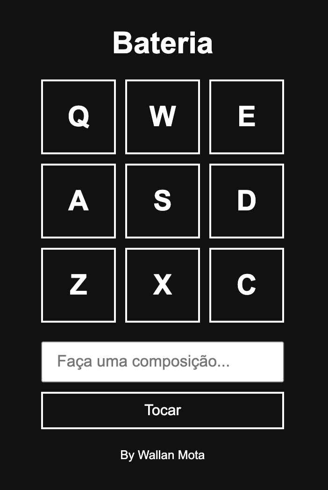

# Bateria

## A aplicação

A aplicação tem um funcionamento bastante simples: ao digitar uma das teclas é reproduzido um som, como uma bateria eletronica, também é possivel "fazer uma composição".

[**Clique Aqui**](https://wallanmota.github.io/Bateria/ "target=_blank") para ver o projeto funcionando.

#

Projeto criado na aula do professor Bonieky Lacerda

